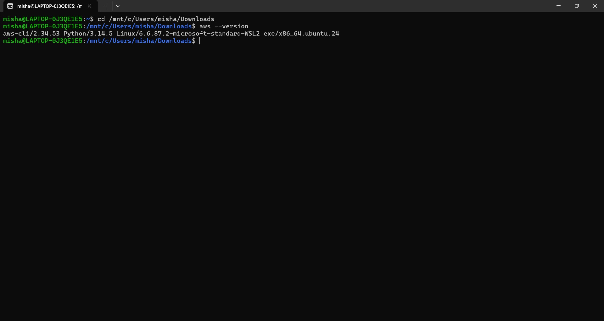
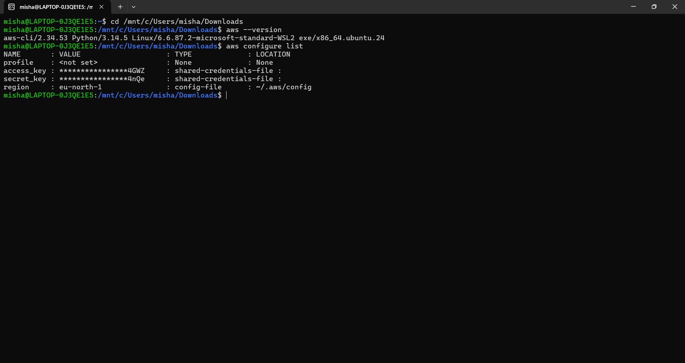
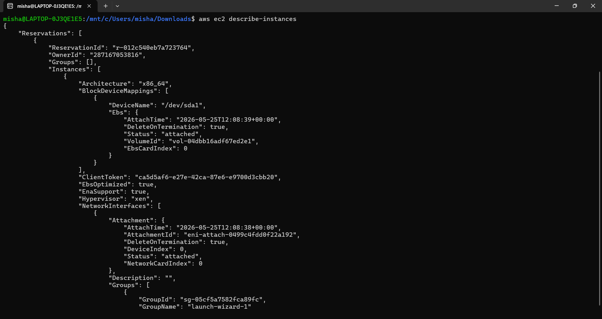
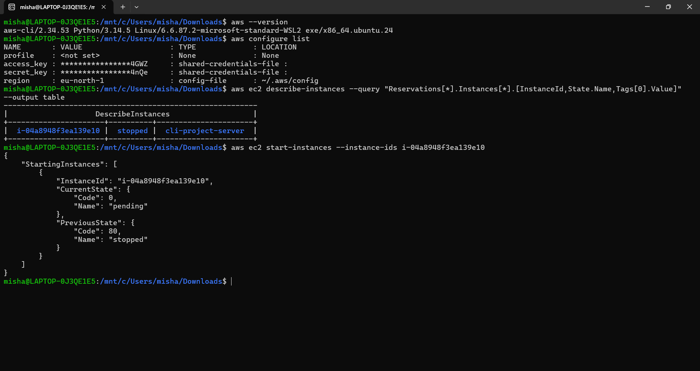
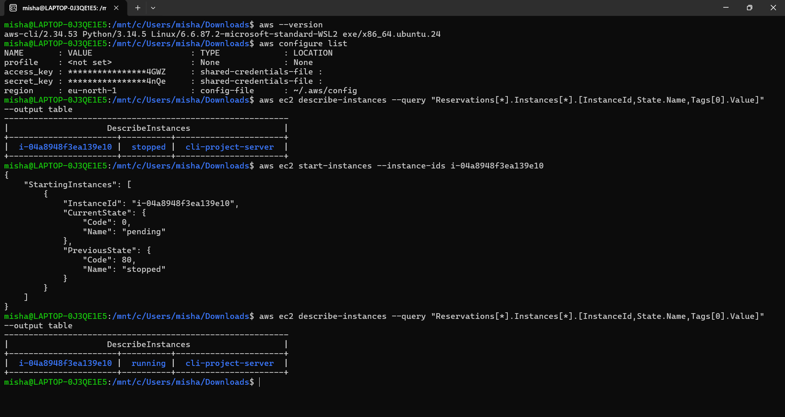
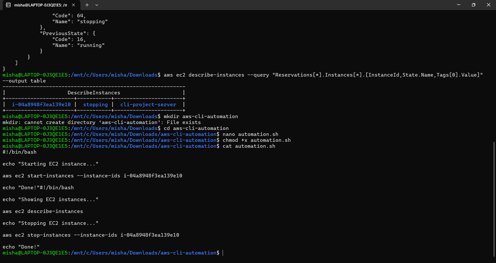
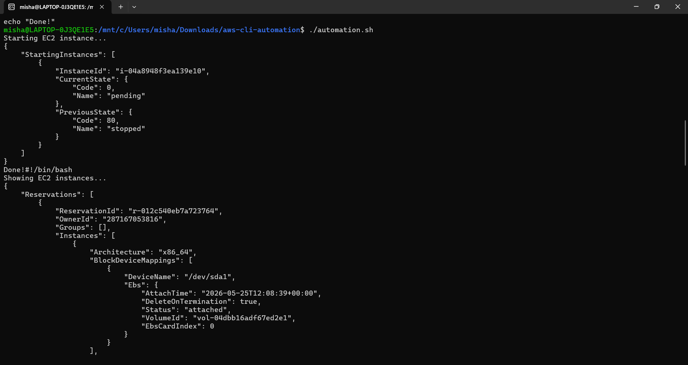
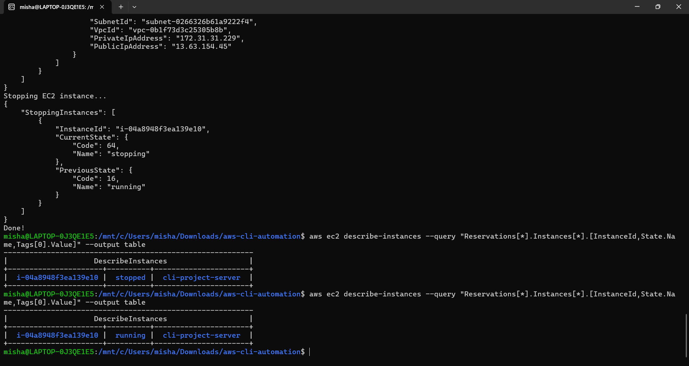

# 🚀 AWS CLI Automation Project


---

## 📌 Project Overview

This project demonstrates **AWS infrastructure automation** using AWS CLI and Bash scripting.

It automates EC2 instance operations such as starting, stopping, and monitoring instances using terminal commands instead of AWS Console.

---

## 🧠 Architecture Flow

User (Terminal)
↓
AWS CLI Commands
↓
IAM Authentication
↓
AWS EC2 Service
↓
Instance Lifecycle Management

---

## ⚙️ Technologies Used

- AWS CLI
- Amazon EC2
- IAM (Identity and Access Management)
- Bash Scripting
- Ubuntu Terminal
- Git & GitHub

---

## ✨ Features

- AWS CLI configuration using IAM user
- EC2 instance lifecycle management
- Start EC2 instance using CLI
- Stop EC2 instance using CLI
- Automate EC2 operations using Bash script
- Real-time cloud resource control from terminal

---

## 🖥️ AWS Services Used

- Amazon EC2
- IAM

---

## 🔧 Commands Used

## 🔧 AWS CLI Commands

### ▶️ Start EC2 Instance
aws ec2 start-instances --instance-ids <instance-id>

### ⏹ Stop EC2 Instance
aws ec2 stop-instances --instance-ids <instance-id>

📄 Describe EC2 Instances
aws ec2 describe-instances

🤖 Automation Script
```bash
#!/bin/bash

echo "Checking EC2 instances..."

aws ec2 describe-instances

echo "Stopping EC2 instance..."

aws ec2 stop-instances --instance-ids <instance-id>

echo "Automation Completed!"
```

📁 PROJECT STRUCTURE

aws-cli-automation/
│
├── automation.sh
├── README.md
└── screenshots/

📸 SCREENSHOTS

1️⃣ AWS CLI Version Check  


2️⃣ AWS Configuration  


3️⃣ EC2 Instance Details  


4️⃣ EC2 Instance Running  


5️⃣ EC2 Instance Stopped  


6️⃣ Automation Script Code  


7️⃣ Automation Script Execution  


8️⃣ EC2 Running After Automation  


---

📊 WHAT I LEARNED

AWS CLI fundamentals
EC2 instance lifecycle management
IAM authentication flow
Bash scripting automation
Cloud infrastructure basics
DevOps workflow using terminal

🏁 CONCLUSION

This project demonstrates real-world AWS cloud automation using CLI instead of GUI, simulating DevOps-style infrastructure management.

👤 AUTHOR

Name: Misha Mohammadi
GitHub: https://github.com/MishaMohammadi
Project: AWS CLI Automation Project
